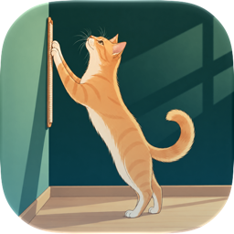

# A scratchpad for a cat

Scratchpad's Dock icon is a ginger cat stretching up to scratch a wall-mounted pad, in a green room with warm sunlight. It uses the Icon Composer document supplied by Nikita, including its original artwork and material settings.



The source is `Scratchpad/Scratchpad.icon`, a native Icon Composer document containing one PNG layer. The layer's scale is 0.82; the native renderer supplies the icon mask, lighting, highlights, and shadow. The supplied bundle is kept unchanged.

Open the `.icon` document in Icon Composer to edit materials or inspect appearances. The Xcode app icon build setting is `Scratchpad`, matching the document name. Xcode compiles it into the app's asset catalog and generates the macOS icon resources.

Run `./scripts/preview-icon.sh` to export native appearance previews and a 64-pixel Dock-size preview into `build/IconPreviews`. This uses `ictool` bundled with the selected Xcode. Then run `./scripts/install.sh` to install the updated release.

## README header

The README pairs the rendered icon with a SignPainter wordmark and a short Avenir Next tagline, following the simple layout of [Sweep's README](https://github.com/nikstar/sweep). Transparent light and dark versions use the icon's green and ginger palette. The PNGs are rendered at twice their display size.

Regenerate the header and this page's icon preview on macOS:

```sh
./scripts/preview-icon.sh
xcrun swift scripts/render-readme-header.swift
```

The renderer uses system fonts and AppKit; no additional dependencies are required.
